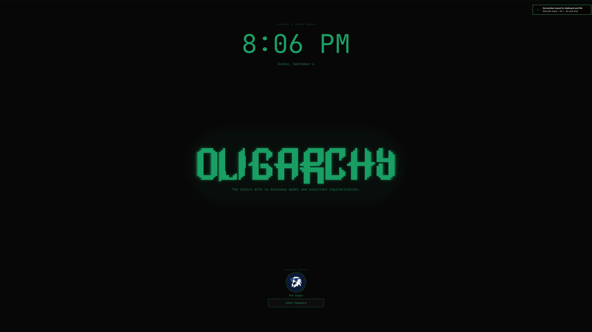

# Oligarchy Lock Screen

 

An Oligarchy-themed lock screen for Omarchy Quickshell, with a dark executive-panel aesthetic, a green phosphor glow treatment, bundled wordmark assets, and preserved password/fingerprint authentication.

## Screenshots



## Features

- **Oligarchy wordmark** — bundled ASCII source and tightly cropped generated PNG.
- **Selectable lock color** — use one of 20 bundled high-contrast colors through `~/.lockcolor`, with the Omarchy accent retained as the safe fallback.
- **Blurred current wallpaper** — uses Omarchy's stock cache-busted wallpaper loading and blur treatment behind the Oligarchy composition.
- **Hot reload friendly** — local plugin edits are picked up by the running Omarchy shell.
- **Personal identity** — reads `~/.displayName`, then falls back to the runtime username; loads `~/.face` when available.
- **Authentication preserved** — password PAM, fingerprint support, wake handling, focus recovery, and failure states remain in `Service.qml`.
- **Local assets** — tagline selection does not depend on another plugin staying installed.
- **Official banner source** — uses the vectorized Oligarchy banner from the companion screensaver project.
- **Marketplace preview** — includes a root-level preview.png lockscreen image.
- **Password visibility** — toggles masked or visible entry text with the eye control; masking is restored when the lock view deactivates.

## Installation

```sh
omarchy plugin add https://github.com/thetxeagle/omarchy-oligarchy-quickshell-lockscreen.git --enable
```

The plugin requires Omarchy Quickshell, Qt5Compat GraphicalEffects, `shuf`, ImageMagick, `fc-match`, and JetBrains Mono Nerd Font. Plugins run unsandboxed; review the source before installing.

## Personalization

### Identity

Create `~/.displayName` with a non-empty name to customize the greeting. If absent or empty, the current logged-in username is shown. Add `~/.face` for a circular avatar; a user glyph is used when it cannot load.

### Display standby timer

Create `~/.locktimer` with a whole number of seconds to control how long the rendered lockscreen remains visible before Omarchy puts the displays into DPMS standby. For example:

```sh
printf '%s\n' 300 > ~/.locktimer
```

| `~/.locktimer` value | Behavior |
| --- | --- |
| Missing or invalid | Use the 25-second default |
| `0` | Keep the rendered lockscreen visible indefinitely |
| Positive whole number | Enter DPMS standby after that many seconds |

Values larger than 2,147,483 seconds are treated as invalid. The file is read again on every lock, so changes do not require reinstalling or restarting the plugin. Display wake and monitor handling remain delegated to stock Omarchy: input wakes the existing secure lockscreen without reloading Hyprland or changing monitor topology.

### Lockscreen color

Copy the bundled 20-color palette into your home directory:

```sh
cp ~/.config/omarchy/plugins/io.github.thetxeagle.oligarchy-lock/lockcolor.example ~/.lockcolor
```

Every palette entry starts disabled with `#`. Remove the first `#` from exactly one line to select that color:

```text
#39FF14  Phosphor Green
00E5FF  Electric Cyan
#7C4DFF  Covenant Violet
```

In this example, Electric Cyan is active. Keep the six-digit hex value itself unchanged; the plugin adds the color prefix internally. The file is read at shell startup and again for every lock or preview. If `~/.lockcolor` is missing, contains no active valid entry, or contains more than one active entry, the lockscreen safely falls back to the current Omarchy accent color.

### Background

The lockscreen automatically loads the current Omarchy wallpaper, crops it to each output, and applies the same blur and reduced-contrast effect as the stock Omarchy lockscreen. If the wallpaper is unavailable, the existing dark Oligarchy background remains as the fallback.

## Regenerate the wordmark

Edit `assets/source/oligarchy.txt`, then run:

```sh
scripts/regenerate-wordmark.sh
```

The script discovers JetBrains Mono Nerd Font with `fc-match`, renders from the original source, trims transparent padding, and writes a fresh deterministic PNG.

The lock view uses the transparent raster derived from
`assets/source/oligarchy-logo.svg`, adapted from the vectorized banner shipped by
[fabiopauli/omarchy-oligarchy-plugin](https://github.com/fabiopauli/omarchy-oligarchy-plugin).

## Development and validation

```sh
bash -n scripts/regenerate-wordmark.sh
jq empty manifest.json
omarchy plugin validate .
```

After QML changes, reload the shell and inspect logs before testing the lock:

```sh
omarchy restart shell
journalctl --user -b --no-pager | grep -iE 'LockView|io\.github\.thetxeagle\.oligarchy-lock|qml' | tail -50
omarchy system lock
```

Malformed `LockView.qml` can cause `Type LockView unavailable` and make `omarchy system lock` report `Target not found.` Keep a backup before replacing a working lock view. To restore the stock lock plugin, disable this plugin and re-enable `omarchy.lock` through Omarchy's plugin workflow.

## Contributing

Open an issue or pull request with the exact Omarchy version, theme, display setup, and relevant journal lines. Do not include passwords or authentication secrets.

## License

MIT. See [LICENSE](LICENSE).
